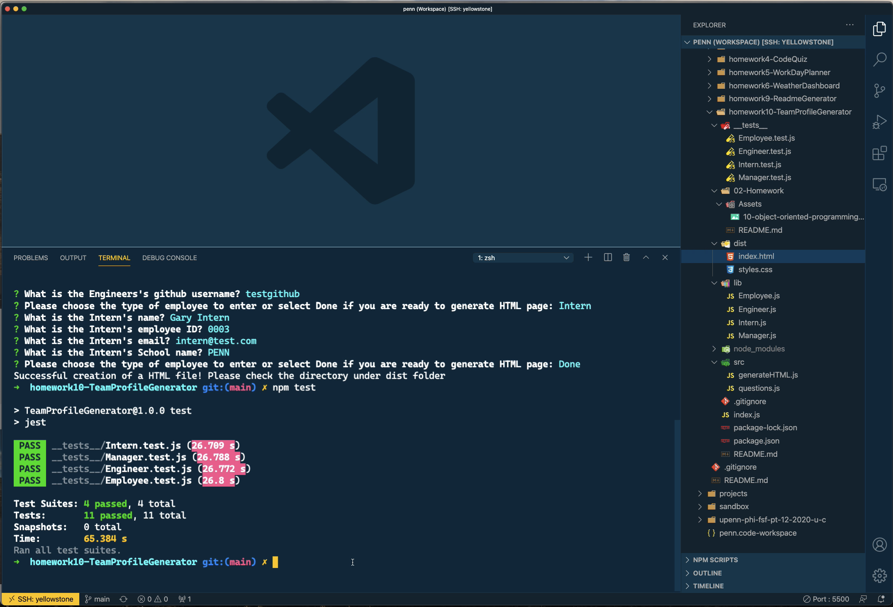

# Node.js: Team Profile Generator

## Description 
  
Create a command-line application tto build a Node.js command-line application that takes in information about employees on a software engineering team, then generates an HTML webpage that displays summaries for each person from a user's input using the [Inquirer package](https://www.npmjs.com/package/inquirer). Check out the [`index.html`](./dist/index.html) in this repo as an example final product. 

## Table of Contents
* [Installation](#installation)
* [Usage](#usage)
* [Methodology](#methodology)
* [License](#license)
  

## Installation

*Steps required to install project and how to get the development environment running:*

To generate your own README, first run `npm install` in order to install the following npm package dependencies
  * [`inquirer`](https://www.npmjs.com/package/inquirer)
  * [`jest`](https://www.npmjs.com/package/jest)

The application itself can be invoked with `node index.js`.

The application testing can be invoked with `npm test` to test `Employee`, `Manager`, `Engineer`, and `Intern` classes.

## Usage 

*Instructions and examples for use:*

Click on the screenshot below to watch a demo video:

When you run `node index.js`, the application uses the `inquirer` package to prompt you in the command line with a series of questions about your team. The application will generate a final HTML file styled for easy user experience. The application uses `fs.writeFileSync` is used to generate the index HTML file. Check out the [`index.html`](./dist/index.html) in this repo as an example final product. 

## License

MIT License

---

## Questions?

* Please submit any questions at my [GitHub profile](https://github.com/grider27)

* Also, you can reach me via email @ grider27@gmail.com
