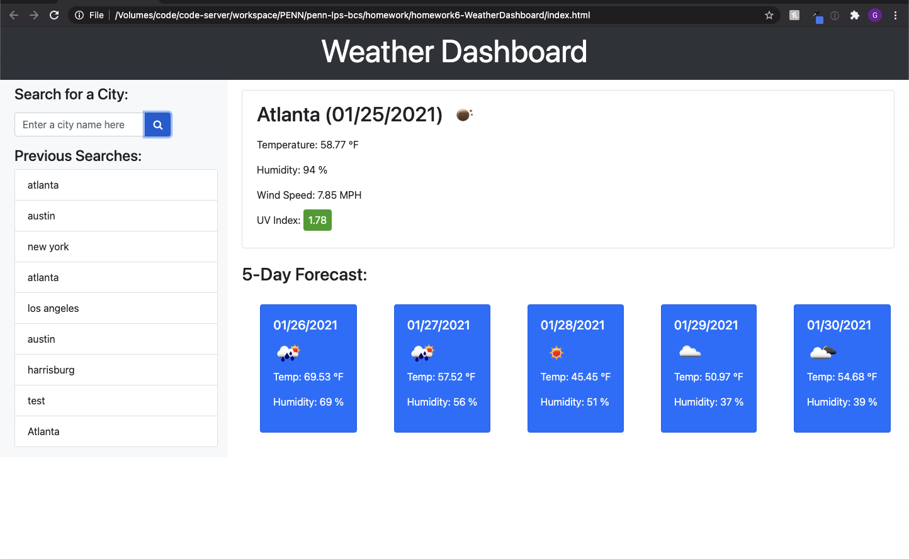

# 06 Server-Side APIs: Weather Dashboard

## Task Overview

* Create a weather dashboard that will run in the browser and feature dynamically updated HTML and CSS.

## Link to the website deployed

[GitHub Repo URL](https://github.com/grider27/penn-lps-bcs/tree/main/homework/homework6-WeatherDashboard)


[GitHub Page URL](https://grider27.github.io/penn-lps-bcs/homework/homework6-WeatherDashboard/)


## User Story

```
AS A traveler
I WANT to see the weather outlook for multiple cities
SO THAT I can plan a trip accordingly
```

## Acceptance Criteria

```
GIVEN a weather dashboard with form inputs
WHEN I search for a city
THEN I am presented with current and future conditions for that city and that city is added to the search history
WHEN I view current weather conditions for that city
THEN I am presented with the city name, the date, an icon representation of weather conditions, the temperature, the humidity, the wind speed, and the UV index
WHEN I view the UV index
THEN I am presented with a color that indicates whether the conditions are favorable, moderate, or severe
WHEN I view future weather conditions for that city
THEN I am presented with a 5-day forecast that displays the date, an icon representation of weather conditions, the temperature, and the humidity
WHEN I click on a city in the search history
THEN I am again presented with current and future conditions for that city

```

## Finished product 



## Original Reference Mock-Up for Final Product

The following image shows the web application's appearance and functionality:

